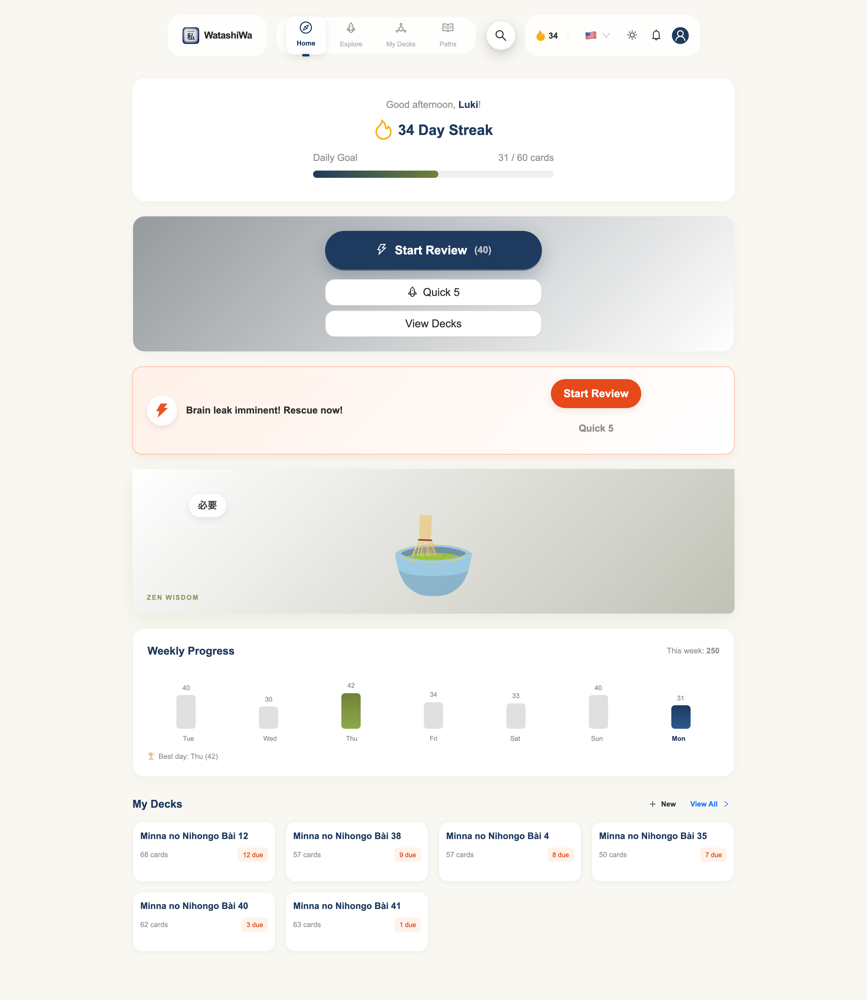
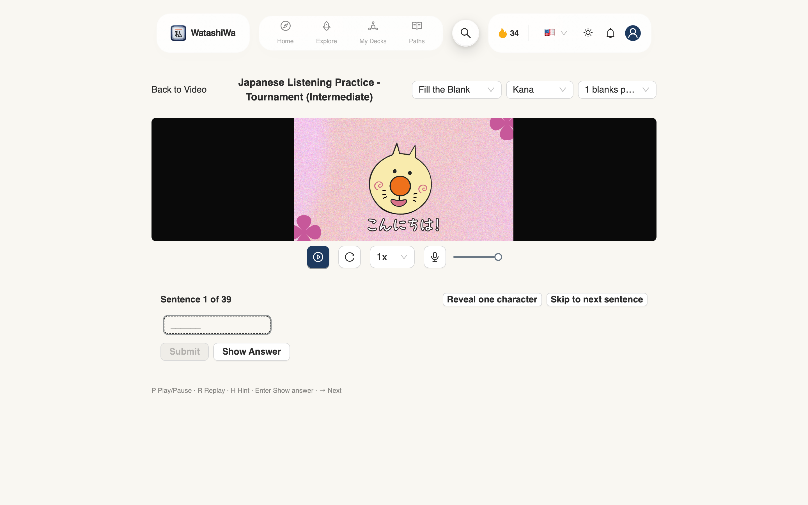
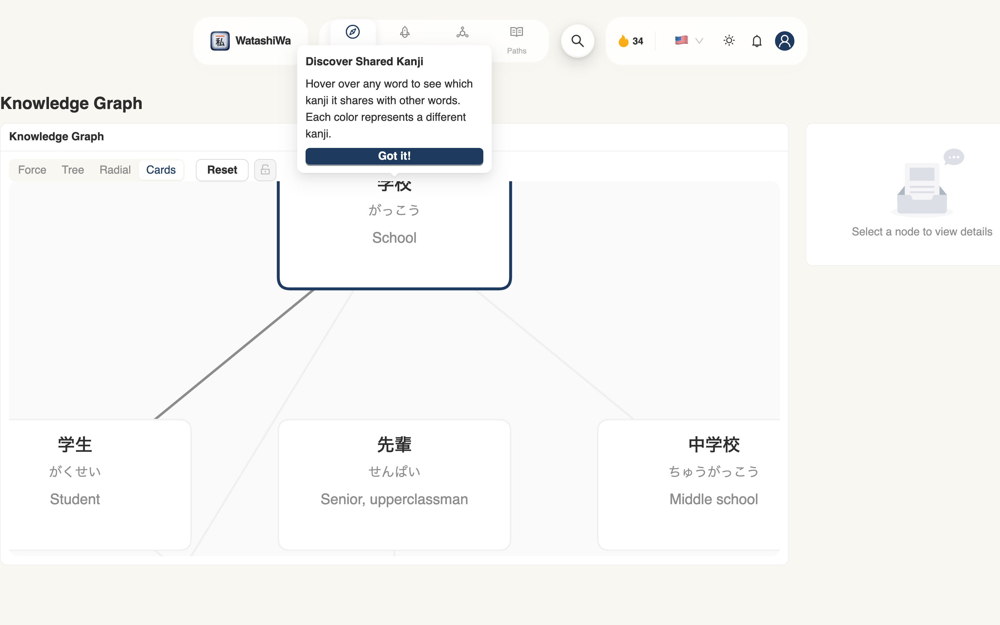
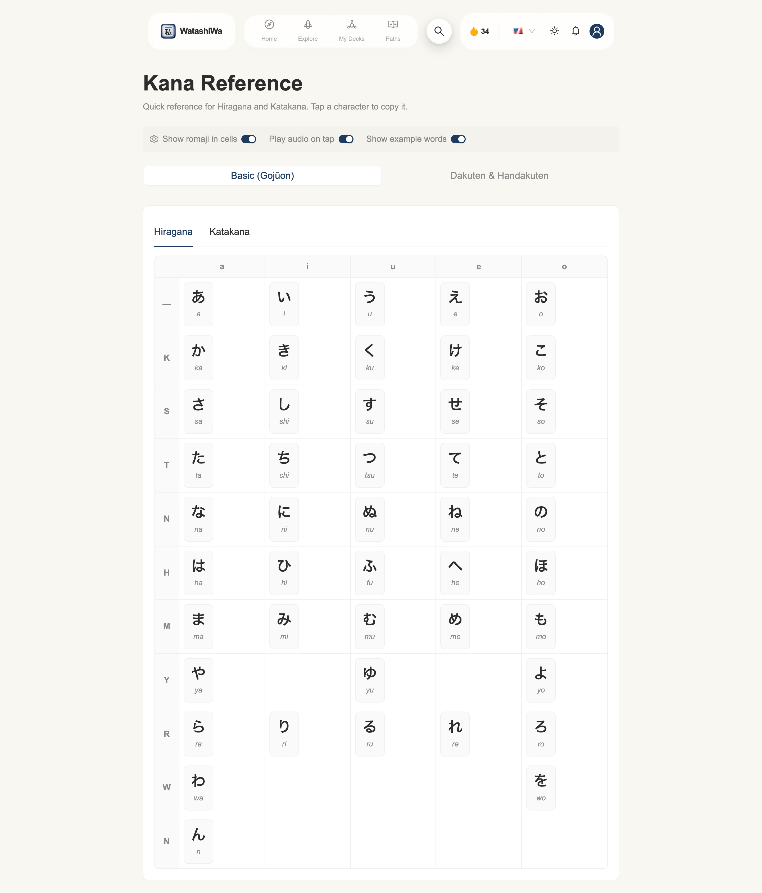
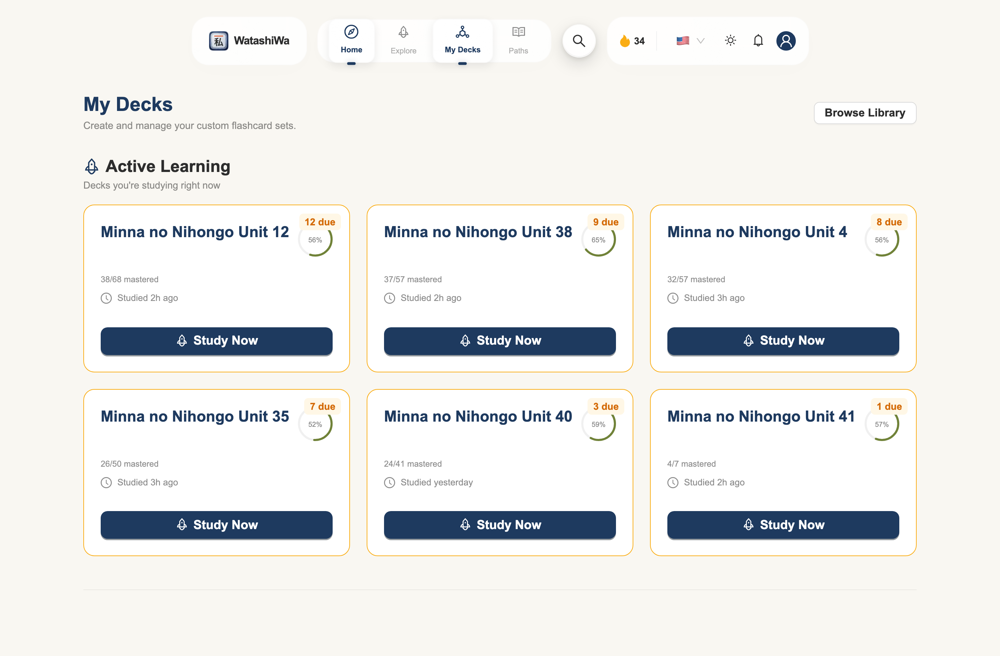
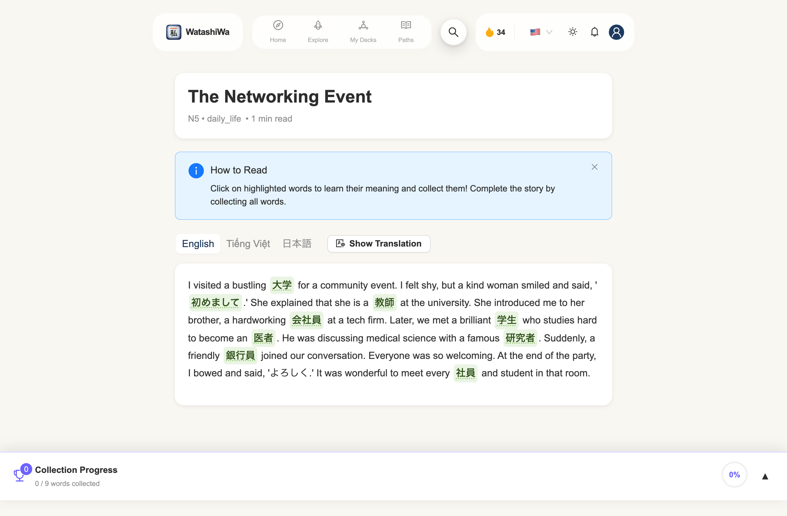

<div align="center">

# WatashiWa（私は）

**Learn Japanese chill — and remember it for the long run.**

A Japanese vocabulary-learning platform built around spaced repetition and the
**CUBE** method: words are learned in meaningful context, connected by shared
kanji and etymology, rather than memorised in isolation.

[Features](#features) · [Screenshots](#screenshots) · [Tech stack](#tech-stack) · [Getting started](#getting-started) · [Architecture](#architecture)

</div>

---

## Overview

WatashiWa helps learners build durable Japanese vocabulary by combining a proven
spaced-repetition system (SRS) with richer learning signals — etymology, Hán-Việt
readings, confusion detection, and immersion through real video and graded
stories. Content is grounded in the *Minna no Nihongo* curriculum and is fully
bilingual (English / Vietnamese) with Japanese throughout.

> The **CUBE** method — **C**ontext, **U**nderstanding, **B**locking, **E**ncoding —
> presents words in semantic groups, surfaces *why* a word means what it means,
> proactively prevents mix-ups between similar words, and adapts practice to your
> learning stage.

## Features

- **🎴 Spaced repetition (SRS)** — an FSRS-based scheduler with daily pacing controls, streaks, and progress analytics.
- **🎧 Listen & Type video practice** — type what you hear from real Japanese video; fill-in-the-blank and full-sentence modes with kana/kanji answer checking and per-character hints.
- **🕸️ Knowledge graph** — vocabulary visualised as a network of shared-kanji relationships.
- **🈁 Kana reference** — Hiragana/Katakana tables with romaji, audio, and example words.
- **📚 Decks & learning paths** — curated *Minna no Nihongo* decks and multi-deck courses, plus custom decks.
- **📖 Graded reading** — level-appropriate stories with tap-to-collect vocabulary and multilingual translations.
- **🛡️ Confusion shield** — proactively flags easily-confused words, homonyms, and pitch-accent patterns.
- **🌏 Internationalised** — English and Vietnamese UI, Japanese content, with per-user language preferences.
- **📱 PWA** — installable, offline-aware, with push reminders.

## Screenshots

| Dashboard | Listen & Type practice |
|---|---|
|  |  |

| Knowledge graph | Kana reference |
|---|---|
|  |  |

| My decks | Graded reading |
|---|---|
|  |  |

➡️ **See the [full screenshot gallery](docs/screenshots/README.md)** for every screen.

<!-- TODO: add a live demo link here once deployed, e.g. **Live demo:** https://watashiwa.app -->

## Tech stack

| Area | Choices |
|---|---|
| Framework | Next.js 16 (App Router, Server Actions, PPR), React 19 |
| Language | TypeScript (strict) |
| Data | PostgreSQL + Prisma 7 (driver adapters) |
| Auth | Supabase Auth (SSR cookies) |
| UI | Ant Design 6, Framer Motion, an iOS-inspired glass design system |
| i18n | next-intl (en / vi) |
| Validation | Zod 4 end-to-end (server actions + DTOs) |
| Background jobs | Inngest (email verification, reminder cron) |
| Observability | Sentry, PostHog |
| Testing | Vitest (integration against a real Postgres), Playwright (E2E) |

## Getting started

**Prerequisites:** Node 20+, pnpm 9+, and a PostgreSQL 15+ instance.

```bash
# 1. Install dependencies
pnpm install

# 2. Configure environment
cp .env.example .env        # then fill in DATABASE_URL, Supabase keys, etc.

# 3. Set up the database
pnpm db:generate            # generate the Prisma client
pnpm prisma migrate deploy  # apply migrations

# 4. Seed reference content (vocabulary, kanji, stories, courses)
pnpm db:seed

# 5. Run
pnpm dev                    # http://localhost:3000
```

### Testing

```bash
pnpm test:db:setup     # start a disposable Postgres (Docker)
pnpm test:integration  # Vitest against the real DB
pnpm e2e               # Playwright end-to-end flows
```

### Screenshots

The gallery is generated against a seeded demo account:

```bash
pnpm tsx scripts/seed-demo-activity.ts          # seed realistic demo activity
SCREENSHOT_AUTH_USER_ID=<demo-user-id> pnpm dev # run with the demo login
pnpm tsx scripts/capture-screenshots.ts         # capture to docs/screenshots/
```

## Architecture

The codebase is organised by **feature module** under `src/modules` (auth, study,
videos, decks, priming/stories, user, …), with shared infrastructure in `src/lib`
and `src/utils`. Highlights:

- **Server Actions + Zod** — every mutation flows through a typed `executeSafeAction`
  wrapper that handles auth context and validation.
- **Real-database testing** — integration tests run against an actual Postgres
  instance rather than mocks, for confidence in queries and constraints.
- **Type-safe i18n** — messages are namespaced and validated per locale.

Deeper documentation lives in [`docs/`](docs/) — see
[`architecture.md`](docs/architecture.md), [`design_system.md`](docs/design_system.md),
and [`modules.md`](docs/modules.md).

## License

Proprietary — all rights reserved.
