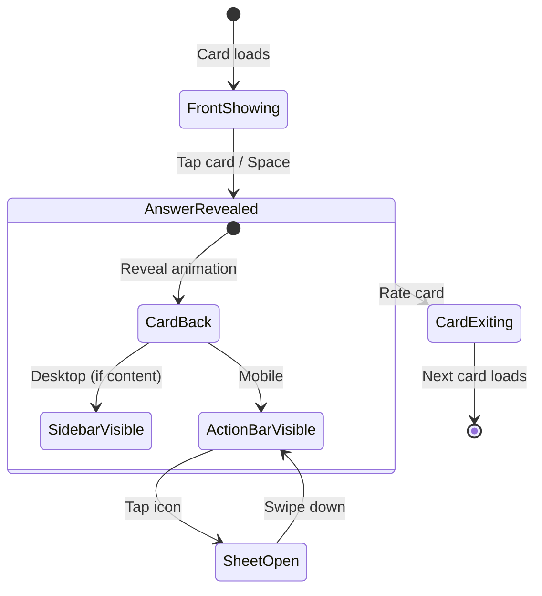

# Feature PRD: Study Session UX Redesign

**Author:** iDev  
**Date:** 2026-01-05  
**Status:** Draft - Pending Review  
**Parent PRD:** [Main Product PRD](./prd.md)  
**Design Spec:** [Study Session UX Redesign v2.0](./study-session-ux-redesign.md)

---

## Executive Summary

### Feature Overview

The Study Session UX Redesign transforms the current flashcard study experience from **information overload** to **progressive semantic discovery**. This redesign directly addresses critical UX issues that break the "Zen" learning flow while implementing the PRD's core vision of semantic learning networks.

### The Problem

| Issue                             | Impact                        | User Pain                               |
| --------------------------------- | ----------------------------- | --------------------------------------- |
| Related Words appear below card   | Layout breaks, scroll fatigue | "I lose my focus when the page jumps"   |
| Card too small on desktop (600px) | Wasted screen real estate     | "Feels like a mobile app on my desktop" |
| Example section always visible    | Information overload          | "Too much text overwhelms me"           |
| Same layout on all devices        | Suboptimal experience         | "Works but feels wrong"                 |

### The Solution

**Progressive Semantic Disclosure**: Show less initially. Reveal knowledge connections when the learner is ready.

```
Card Only → Subtle Hints → Expand on Demand → Semantic Discovery
```

### Success Metrics

| Metric                  | Current Baseline | Target                 | Measurement                             |
| ----------------------- | ---------------- | ---------------------- | --------------------------------------- |
| Session completion rate | ~85%             | 95%+                   | Analytics: sessions completed / started |
| Time on answer reveal   | Unknown          | <2s decision           | Analytics: time to rating               |
| Feature discovery rate  | N/A              | 60%+ use Related Words | Analytics: sidebar/sheet opens          |
| Layout-induced scroll   | Frequent         | Zero                   | QA: no scroll needed on any viewport    |
| User satisfaction       | Unknown          | 4.5+ stars             | In-app feedback prompt                  |

---

## Alignment with Product Vision

### PRD Core Principles Addressed

| PRD Principle                          | How This Feature Delivers                                              |
| -------------------------------------- | ---------------------------------------------------------------------- |
| **Semantic Connections > Perfect SRS** | Related Words sidebar/sheet makes connections visible and discoverable |
| **Vietnamese-First Design**            | All ARIA labels and UI text in Vietnamese; Hán Việt bridges prominent  |
| **Focus First (Zen)**                  | Card is the hero; progressive disclosure reduces cognitive load        |
| **Knowledge Graph Visualization**      | Sidebar presents semantic network as explorable list                   |

### PRD Functional Requirements Addressed

| Requirement                                         | Implementation                                      |
| --------------------------------------------------- | --------------------------------------------------- |
| **FR10**: Visualize vocabulary as semantic networks | Sidebar shows Related Words with relationship types |
| **FR14**: Highlight semantic connections            | Related Words appear automatically on answer reveal |
| **FR19**: Detect confusion patterns                 | Confusions section in sidebar with warning icon     |
| **FR21**: Multi-modal feedback                      | Visual (animations) + Haptic (button presses)       |
| **FR27**: Vietnamese interface                      | Full i18n with Vietnamese ARIA labels               |
| **FR35**: Seamless study session flow               | Progressive disclosure prevents layout breaks       |

---

## User Stories

### Story 1: Linh Discovers Related Words (Desktop)

**As** Linh, a JLPT N4 learner studying on her laptop,  
**I want** to see related vocabulary after revealing an answer,  
**So that** I can build semantic connections without leaving my study flow.

**Acceptance Criteria:**

- [ ] After revealing answer, sidebar slides in from right (300ms, ease-out)
- [ ] Sidebar shows Related Words grouped by relationship type (Hán Việt, Same Reading, etc.)
- [ ] Clicking a related word shows a preview (not full navigation)
- [ ] Sidebar only appears if content exists (no empty sidebar)
- [ ] Rating card auto-closes sidebar

### Story 2: Tuấn Uses Related Words on Mobile

**As** Tuấn, a beginner studying during my commute on mobile,  
**I want** to access related words without losing sight of my current card,  
**So that** I can explore connections quickly and return to rating.

**Acceptance Criteria:**

- [ ] Subtle action bar appears below card after answer reveal
- [ ] Tapping 🔗 icon opens bottom sheet (50vh default)
- [ ] Sheet can be dragged to 90vh for long lists
- [ ] Swiping down or tapping mask closes sheet
- [ ] Sheet auto-closes when rating is submitted

### Story 3: Preserving Focus with Collapsible Examples

**As** a learner who finds long example sentences distracting,  
**I want** to collapse the example section by default on mobile,  
**So that** I can focus on the core vocabulary first.

**Acceptance Criteria:**

- [ ] Example section is collapsible (collapsed by default on mobile, expanded on desktop)
- [ ] Collapse preference is persisted per-user in `useStudyPreferences`
- [ ] Collapse/expand animates smoothly (200ms)
- [ ] Section header shows chevron indicating expand/collapse state

### Story 4: Polished Rating Experience

**As** a daily user,  
**I want** rating buttons that feel satisfying to tap,  
**So that** the study experience feels premium and intentional.

**Acceptance Criteria:**

- [ ] Remember button: gradient background, glow shadow
- [ ] Forgot button: subtle outline, muted background
- [ ] 52px height on mobile, 60px on desktop (WCAG touch targets)
- [ ] Haptic feedback on button press (mobile)
- [ ] Scale animation on press (0.97 for 150ms)

---

## Feature Scope

### In Scope (MVP)

| Component                 | Desktop (≥768px)                        | Mobile (<768px)                 |
| ------------------------- | --------------------------------------- | ------------------------------- |
| **FlashCard Sizing**      | 800px max-width, auto height (max 80vh) | 600px max-width, 65vh fixed     |
| **Related Words Display** | Sidebar (320px, sticky, slide-in)       | Bottom Sheet (50vh, draggable)  |
| **Subtle Action Bar**     | Hidden (content in sidebar)             | 4 ghost icons below card        |
| **Collapsible Example**   | Expanded by default                     | Collapsed by default            |
| **Rating Bar**            | 2-button gradient (60px height)         | 2-button gradient (52px height) |
| **Progress Indicator**    | Existing (header bar)                   | Existing (header bar)           |
| **Settings Persistence**  | Collapse states + section visibility    | Same                            |

### Out of Scope (Future Iterations)

| Feature                                     | Reason                              | Future Phase |
| ------------------------------------------- | ----------------------------------- | ------------ |
| 3D Knowledge Graph Visualization            | Separate feature scope              | Phase 2      |
| Etymology/Radicals Section                  | Requires data not yet available     | Phase 2      |
| AI-generated mnemonics                      | Algorithm complexity                | Phase 2      |
| Session Summary with connections            | Post-session UX                     | Phase 2      |
| Algorithm transparency UI                   | Backend dependency                  | Phase 2      |
| 4-button FSRS rating (Again/Hard/Good/Easy) | Simplicity over granularity for MVP | Phase 2      |
| "More Examples" feature                     | Requires additional example data    | Phase 2      |

---

## Technical Requirements

### Performance Requirements

| Metric             | Target | Rationale                       |
| ------------------ | ------ | ------------------------------- |
| Sidebar slide-in   | 300ms  | Feels responsive, not sluggish  |
| Card transitions   | <100ms | PRD requirement for smooth flow |
| Bottom sheet open  | 300ms  | Match Material Design standards |
| Collapse animation | 200ms  | Fast enough to feel instant     |
| Related Words data | <500ms | PRD semantic algorithm target   |

### Accessibility Requirements (WCAG 2.1 AA)

| Requirement         | Implementation                                        |
| ------------------- | ----------------------------------------------------- |
| Color contrast      | 4.5:1 minimum via Zen Mastery tokens                  |
| Touch targets       | 44px minimum (action icons: 40px + 8px gap)           |
| Keyboard navigation | R = Related Words, E = Toggle Example, Escape = Close |
| Screen reader       | ARIA roles and Vietnamese labels                      |
| Focus indicators    | 2px outline, offset 2px                               |

### Responsive Breakpoints

| Breakpoint | Layout                                    | Card Size                  |
| ---------- | ----------------------------------------- | -------------------------- |
| <768px     | Single column + action bar + bottom sheet | 600px max, 65vh            |
| ≥768px     | Two-column grid (card + sidebar)          | 800px max, auto (max 80vh) |

---

## Interaction Specifications

### State Machine



### Rating System (FSRS Mapping)

> **Decision**: 2-button simplified rating for cleaner UX, mapped to FSRS algorithm.

| UI Button        | FSRS Grade        | Description             |
| ---------------- | ----------------- | ----------------------- |
| **Forgot** (↻)   | `Again` (Grade 1) | User failed to recall   |
| **Remember** (✓) | `Good` (Grade 3)  | User recalled correctly |

**Rationale**: Reduces cognitive load during study flow. Advanced users can use keyboard shortcuts for granular control if needed in future phases.

### Keyboard Shortcuts

| Key        | Action                          | Context         |
| ---------- | ------------------------------- | --------------- |
| `Space`    | Reveal answer / Rate "Remember" | Any             |
| `1`        | Rate "Forgot"                   | Answer revealed |
| `2` or `3` | Rate "Remember"                 | Answer revealed |
| `R`        | Open Related Words              | Answer revealed |
| `E`        | Toggle Example                  | Answer revealed |
| `Escape`   | Close any panel                 | Panel open      |

### Haptic Feedback (Mobile)

| Action              | Pattern                |
| ------------------- | ---------------------- |
| Button press        | 10ms vibration         |
| Rating submit       | 15ms vibration         |
| Breakthrough moment | [20, 50, 20]ms pattern |

---

## Component Specifications

### New Components to Create

| Component            | Path                                                              | Purpose                          |
| -------------------- | ----------------------------------------------------------------- | -------------------------------- |
| `CollapsibleSection` | `src/modules/shared/components/CollapsibleSection.tsx`            | Reusable collapse with animation |
| `StudySidebar`       | `src/modules/study/components/Session/StudySidebar.tsx`           | Desktop sidebar container        |
| `SubtleActionBar`    | `src/modules/study/components/Session/SubtleActionBar.tsx`        | Mobile ghost icon bar            |
| `RelatedWordsSheet`  | `src/modules/study/components/RelatedWords/RelatedWordsSheet.tsx` | Mobile bottom sheet              |

### Components to Modify

| Component             | Path                                                          | Changes                                         |
| --------------------- | ------------------------------------------------------------- | ----------------------------------------------- |
| `FlashCard`           | `src/modules/flashcard/components/FlashCard.tsx`              | Responsive sizing logic                         |
| `StandardFace`        | `src/modules/flashcard/components/CardShell/StandardFace.tsx` | Collapsible Example                             |
| `SessionController`   | `src/modules/study/components/Session/SessionController.tsx`  | Grid layout, sidebar/sheet orchestration        |
| `RatingBar`           | `src/modules/study/components/Session/RatingBar.tsx`          | 2-button gradient styling, size polish          |
| `useStudyPreferences` | `src/modules/study/store/useStudyPreferences.ts`              | Collapse state + section visibility persistence |

### Settings to Add in `useStudyPreferences`

| Setting                  | Type      | Default                             | Description                                  |
| ------------------------ | --------- | ----------------------------------- | -------------------------------------------- |
| `exampleDefaultExpanded` | `boolean` | `true` (desktop) / `false` (mobile) | Example section collapse state               |
| `showConfusions`         | `boolean` | `true`                              | Show "Easily Confused" section in sidebar    |
| `showEtymology`          | `boolean` | `false`                             | Show "Word Origins" section (future feature) |

---

## Implementation Phases

### Phase 1: Component Refactor & Polish (Low Risk)

**Goal:** Improve existing UI without layout changes.

| Task                                         | Effort | Risk |
| -------------------------------------------- | ------ | ---- |
| Update FlashCard responsive sizing           | S      | Low  |
| Create CollapsibleSection component          | M      | Low  |
| Integrate collapsible into StandardFace      | M      | Low  |
| Polish RatingBar styling                     | S      | Low  |
| Add collapse settings to useStudyPreferences | S      | Low  |

**Exit Criteria:**

- Build passes
- All existing tests pass
- Visual regression check on mobile + desktop

### Phase 2: Layout Restructuring (Medium Risk)

**Goal:** Full responsive layout with sidebar and sheet patterns.

| Task                                   | Effort | Risk   |
| -------------------------------------- | ------ | ------ |
| Create StudySidebar component          | M      | Low    |
| Create RelatedWordsSheet component     | M      | Low    |
| Create SubtleActionBar component       | S      | Low    |
| Refactor SessionController to CSS Grid | L      | Medium |
| Move RelatedWords integration logic    | M      | Medium |
| Add i18n keys for new UI elements      | S      | Low    |

**Exit Criteria:**

- Full E2E test on mobile + desktop viewports
- Accessibility audit passes
- PRD performance targets met

---

## Verification Plan

### Automated Tests

| Test Type                      | Coverage                        | Command                        |
| ------------------------------ | ------------------------------- | ------------------------------ |
| Unit: CollapsibleSection       | Toggle behavior, animation      | `pnpm test CollapsibleSection` |
| Unit: SubtleActionBar          | Visibility logic, callbacks     | `pnpm test SubtleActionBar`    |
| Integration: SessionController | Layout rendering per breakpoint | `pnpm test SessionController`  |

### Manual Verification

| Scenario             | Steps                                                                            | Expected                                          |
| -------------------- | -------------------------------------------------------------------------------- | ------------------------------------------------- |
| Desktop sidebar      | 1. Open study session on 1440px screen<br>2. Reveal answer<br>3. Observe sidebar | Sidebar slides in from right, shows Related Words |
| Mobile sheet         | 1. Open in Chrome DevTools (375px)<br>2. Reveal answer<br>3. Tap 🔗 icon         | Bottom sheet opens at 50vh                        |
| Collapse persistence | 1. Collapse Example section<br>2. Rate card, view next<br>3. Check Example state | Remains collapsed                                 |
| Keyboard shortcuts   | 1. Press Space to reveal<br>2. Press R                                           | Related Words panel opens                         |

### Accessibility Audit

| Check          | Tool                | Target                      |
| -------------- | ------------------- | --------------------------- |
| Color contrast | axe DevTools        | 0 violations                |
| Focus order    | Manual keyboard nav | Logical sequence            |
| Screen reader  | VoiceOver           | Vietnamese labels announced |
| Touch targets  | Chrome DevTools     | ≥44px                       |

---

## Risks & Mitigations

| Risk                                    | Impact | Likelihood | Mitigation                                    |
| --------------------------------------- | ------ | ---------- | --------------------------------------------- |
| Sidebar causes layout shift             | High   | Low        | Fixed 320px width, no content reflow          |
| Bottom sheet performance on old devices | Medium | Medium     | Use native CSS transforms, avoid JS animation |
| Collapse state not persisting           | Low    | Low        | Use Zustand persist middleware                |
| Related Words API slow                  | Medium | Medium     | Show skeleton, don't block rating             |
| Accessibility regression                | High   | Low        | axe-core in CI, manual audit                  |

---

## Dependencies

| Dependency                | Status       | Notes                 |
| ------------------------- | ------------ | --------------------- |
| Ant Design Drawer         | ✅ Available | Used for bottom sheet |
| Framer Motion             | ✅ Available | Used for animations   |
| useStudyPreferences store | ✅ Exists    | Needs extension       |
| RelatedWords component    | ✅ Exists    | Needs variant prop    |
| i18n setup                | ✅ Exists    | Needs new keys        |

---

## Success Criteria

### Launch Checklist

- [ ] Phase 1 deployed and stable for 1 week
- [ ] Phase 2 deployed with feature flag
- [ ] All acceptance criteria for user stories met
- [ ] Performance targets verified in production
- [ ] Accessibility audit passed
- [ ] Vietnamese translations reviewed by native speaker
- [ ] Analytics events implemented for feature discovery tracking

### Post-Launch Monitoring

| Metric                   | Monitoring Method   | Alert Threshold             |
| ------------------------ | ------------------- | --------------------------- |
| Session completion rate  | Analytics dashboard | <90% (down from 95% target) |
| Error rate in study flow | Error tracking      | >0.1%                       |
| Related Words usage      | Analytics event     | <40% discovery rate         |
| Mobile sheet interaction | Analytics event     | <30% of mobile users        |

---

## Appendix: Design Tokens Reference

From `themeConfig.ts` (Zen Mastery theme):

```typescript
// Light Mode
colorPrimary: '#1E3A5F',      // Indigo (focus)
colorSuccess: '#708238',      // Matcha (breakthroughs)
colorError: '#E64A19',        // Vermilion (forgot)
colorBgLayout: '#F9F7F2',     // Washi paper
colorBgBase: '#FFFFFF',       // Component background

// Dark Mode
colorPrimaryDark: '#63B3ED',  // Clear Sky Blue
colorBgLayoutDark: '#0B1120', // Midnight
colorBgBaseDark: '#151F32',   // Deep Slate
```

---

## Document History

| Version | Date       | Author    | Changes                                                                                                      |
| ------- | ---------- | --------- | ------------------------------------------------------------------------------------------------------------ |
| 1.0     | 2026-01-05 | iDev      | Initial draft                                                                                                |
| 1.1     | 2026-01-05 | Architect | Added FSRS 2-button mapping, settings spec, clarified breakpoints, scoped Etymology/More Examples to Phase 2 |
