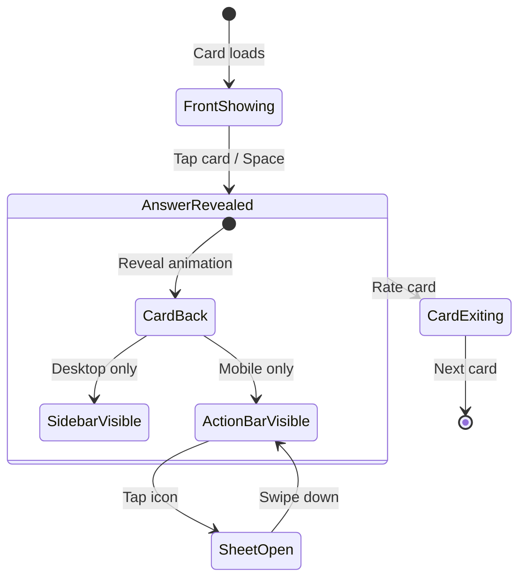

# Study Session UI/UX Redesign v2.0

**Version**: 2.0  
**Date**: 2026-01-04  
**Status**: Draft - Pending Review  
**Design Philosophy**: Zen Mastery + Vietnamese-First Harmony  
**Related Documents**:

- [UX Design Specification](./ux-design-specification.md)
- [UX Evaluation](./study-session-ux-evaluation.md)
- [Story 2.3: Related Words](../implementation-artifacts/2-3-view-semantically-related-words-during-study.md)

---

## 📋 Table of Contents

1. [Executive Summary](#1-executive-summary)
2. [Problem Analysis](#2-problem-analysis)
3. [Design Vision](#3-design-vision)
4. [Layout Architecture](#4-layout-architecture)
5. [Progressive Disclosure System](#5-progressive-disclosure-system)
6. [Component Specifications](#6-component-specifications)
7. [Interaction Design](#7-interaction-design)
8. [Animation & Micro-interactions](#8-animation--micro-interactions)
9. [Responsive Strategy](#9-responsive-strategy)
10. [Accessibility](#10-accessibility)
11. [Implementation Roadmap](#11-implementation-roadmap)
12. [Design Decisions Log](#12-design-decisions-log)

---

## 1. Executive Summary

### The Problem

The current study session UI has critical UX issues that break the "Zen" learning flow:

| Issue | Impact | Severity |
|-------|--------|----------|
| Related Words appear below card | Layout breaks, scroll fatigue | 🔴 Critical |
| Card too small on desktop (600px) | Wasted screen real estate | 🟡 Medium |
| Example section always visible | Information overload | 🟡 Medium |
| Same layout on all devices | Suboptimal experience | 🟡 Medium |
| Rating buttons lack polish | Reduced "click satisfaction" | 🟢 Low |

### The Solution: Progressive Semantic Disclosure

Transform the study experience from **information overload** to **focused discovery**:

```
┌────────────────────────────────────────────────────────────────────┐
│                                                                     │
│   CURRENT: Everything visible → Cognitive overload → Distraction   │
│                                                                     │
│                            ↓                                        │
│                                                                     │
│   PROPOSED: Card focus → Subtle hints → Expand on demand           │
│                                                                     │
│             "Show less. Reveal more. Understand deeply."            │
│                                                                     │
└────────────────────────────────────────────────────────────────────┘
```

### Key Design Principles

| Principle | Application |
|-----------|-------------|
| **🎯 Focus First** | Card is the hero. Nothing distracts from the current word. |
| **📖 Progressive Disclosure** | Show less initially. Let users reveal when ready. |
| **📱 Device-Optimized** | Different layouts for desktop vs mobile. |
| **✨ Polished Interactions** | Premium feel with smooth animations and refined styling. |
| **🇻🇳 Vietnamese-First** | Cultural familiarity creates emotional safety. |

---

## 2. Problem Analysis

### 2.1 Current State Analysis

**Source**: Code review of `FlashCard.tsx`, `StandardFace.tsx`, `SessionController.tsx`, `RatingBar.tsx`

#### Card Component Issues

```typescript
// Current FlashCard.tsx (lines 206-220)
maxWidth: 600,           // ❌ Too small on desktop
height: '65vh',          // ❌ Fixed on all devices
maxHeight: 600,          // ❌ Limits expansion
```

**Problems**:

- Desktop screens (1440px+) show a tiny card with massive empty margins
- Fixed height causes internal scrolling on content-rich cards
- No differentiation between mobile and desktop experience

#### Related Words Layout Break

```tsx
// Current SessionController.tsx (lines 1095-1105)
{showAnswer && (
  <RelatedWords
    relatedWords={relatedWords}
    loading={relatedWordsLoading}
    // ❌ Appears BELOW card in vertical flow
    // ❌ Causes vertical scroll
    // ❌ Pushes rating buttons off-screen on mobile
  />
)}
```

**Root Cause**: RelatedWords is a vertical stack addition, not a spatial integration.

#### Example Section Overload

```tsx
// Current StandardFace.tsx (lines 349-393)
{hasExample && (
  <div style={{ marginBottom: hasMnemonic ? '24px' : '0' }}>
    // ❌ Always visible
    // ❌ No collapse option
    // ❌ Japanese + Vietnamese translation = 4+ lines of text
  </div>
)}
```

**Impact**: On mobile, Example section pushes rating buttons below the fold.

### 2.2 User Pain Points (From Personas)

| Persona | Pain Point | Desired Outcome |
|---------|------------|-----------------|
| **Linh** | "Too much information at once overwhelms me" | Clean card, expand when I'm ready |
| **Tuấn** | "I want to see confusions but not every time" | Show me a hint, I'll click if needed |

### 2.3 Gap Analysis Summary

| Feature | Current | Proposed | Verdict |
|---------|---------|----------|---------|
| Desktop Layout | Single column, 600px | 2-column grid, 800px card | **New Requirement** |
| Card Height | Fixed 65vh | Mobile: fixed, Desktop: auto + max-height | **Validation Needed** |
| Related Words | Below card (breaks layout) | Sidebar (Desktop) / Bottom Sheet (Mobile) | **Excellent Solution** |
| Example Section | Always visible | Collapsible (default: collapsed on mobile) | **High Value** |
| Rating Buttons | Flat colors, basic shadows | Gradients, deeper shadows, better touch targets | **UX Win** |

---

## 3. Design Vision

### 3.1 The "Semantic Zen" Experience

Inspired by **Zen gardens** and **Vietnamese-First Harmony**:

> "Like a Zen garden reveals its beauty gradually, the study session reveals knowledge connections only when the learner is ready to discover them."

**Core Metaphor**: The card is a **meditation focus**. Everything else is peripheral until summoned.

### 3.2 Emotional Journey

```
┌─────────────────────────────────────────────────────────────────────────┐
│                                                                          │
│   1. FOCUS          2. RECALL          3. DISCOVER        4. CONNECT     │
│   ──────────        ────────           ───────────        ────────────   │
│                                                                          │
│   ┌────────┐        ┌────────┐         ┌────────┐         ┌────────┐    │
│   │   ?    │   →    │ ✓ Got  │    →    │ 📚     │    →    │ 🌐     │    │
│   │  大学  │        │  it!   │         │ Related│         │ Network│    │
│   └────────┘        └────────┘         └────────┘         └────────┘    │
│                                                                          │
│   Card only.        Answer +           "What else         Semantic       │
│   No distraction.   subtle hints.      can I learn?"      breakthrough!  │
│                                                                          │
└─────────────────────────────────────────────────────────────────────────┘
```

### 3.3 Design Tokens (Zen Mastery Theme)

From `themeConfig.ts`:

```typescript
// Primary Palette
colorPrimary: '#1E3A5F',      // Indigo (Ai-iro) - Focus & navigation
colorSuccess: '#708238',      // Matcha (Uguisu-iro) - Breakthroughs
colorError: '#E64A19',        // Vermilion (Shuiro) - Forgot/Reset
colorBgLayout: '#F9F7F2',     // Washi paper - App background
colorBgBase: '#FFFFFF',       // Component background

// Dark Mode
colorPrimaryDark: '#63B3ED',  // Clear Sky Blue
colorBgLayoutDark: '#0B1120', // Midnight
colorBgBaseDark: '#151F32',   // Deep Slate
```

---

## 4. Layout Architecture

### 4.1 Desktop Layout (≥768px)

**Two-Column Grid**: Card + Contextual Sidebar

```
┌─────────────────────────────────────────────────────────────────────────────┐
│ [←]                                  ▓▓▓▓▓▓▓▓░░░░░░░░░░░░░░░  [💬] [⚙️]    │
├─────────────────────────────────────────────────────────────────────────────┤
│                                                                             │
│   ┌───────────────────────────────────────────────────┐   ┌─────────────┐  │
│   │                                                   │   │             │  │
│   │                                                   │   │  📚 Related │  │
│   │                    FLASHCARD                      │   │  ─────────  │  │
│   │                                                   │   │  学生       │  │
│   │              ┌─────────────────┐                  │   │  先生       │  │
│   │              │                 │                  │   │  勉強       │  │
│   │              │     大学        │                  │   │             │  │
│   │              │                 │                  │   ├─────────────┤  │
│   │              │   university    │                  │   │             │  │
│   │              │                 │                  │   │  ⚠️ Easily  │  │
│   │              └─────────────────┘                  │   │   confused  │  │
│   │                                                   │   │             │  │
│   │   ┌─ ─ ─ ─ ─ ─ ─ ─ ─ ─ ─ ─ ─ ─ ─ ─ ─ ─ ─ ─ ─┐   │   ├─────────────┤  │
│   │   ╎  📖 Example [▼ Collapse]                ╎   │   │             │  │
│   │   ╎  私は大学に通っています。               ╎   │   │  🔍 Roots   │  │
│   │   ╎  Tôi đang học đại học.                  ╎   │   │             │  │
│   │   └─ ─ ─ ─ ─ ─ ─ ─ ─ ─ ─ ─ ─ ─ ─ ─ ─ ─ ─ ─ ─┘   │   └─────────────┘  │
│   │                                                   │                    │
│   │        max-width: 800px | auto height             │   width: 320px    │
│   │            (max-height: 80vh)                     │   (slide-in)      │
│   └───────────────────────────────────────────────────┘                    │
│                                                                             │
│   ┌───────────────────────────────────────────────────┐                    │
│   │    [  ↻ Forgot  ]        [ ✓ Remember ]           │                    │
│   │       (40%)                  (60%)                │                    │
│   └───────────────────────────────────────────────────┘                    │
│                                                                             │
└─────────────────────────────────────────────────────────────────────────────┘

CSS Grid: gridTemplateColumns: '1fr 320px'
Sidebar: position: sticky | top: 80px | begins hidden | slides in on reveal
```

**Key Design Decisions**:

| Decision | Rationale | Alternative Considered |
|----------|-----------|----------------------|
| 320px sidebar width | Comfortable for reading Vietnamese + Japanese | 280px (too cramped), 400px (takes too much from card) |
| Sticky sidebar | Stays visible while scrolling card content | Fixed (blocks content), Static (scrolls away) |
| Slide-in animation | Non-disruptive reveal, feels like discovery | Fade (too subtle), Instant (jarring) |

### 4.2 Mobile Layout (<768px)

**Single Column + Bottom Sheet Pattern**

```
┌─────────────────────────────────┐
│ [←]                   [💬] [⚙️]│
├─────────────────────────────────┤
│▓▓▓▓▓▓░░░░░░░░░░░░░░░░░░░░░░░░░│ Progress
├─────────────────────────────────┤
│                                 │
│   ┌─────────────────────────┐   │
│   │                         │   │
│   │         大学            │   │
│   │                         │   │
│   │       university        │   │
│   │                         │   │
│   │   ┌ ─ ─ ─ ─ ─ ─ ─ ─ ┐   │   │
│   │   │ Example [▼]     │   │   │
│   │   └ ─ ─ ─ ─ ─ ─ ─ ─ ┘   │   │
│   │                         │   │
│   │    height: 65vh         │   │
│   │    max-width: 600px     │   │
│   │                         │   │
│   └─────────────────────────┘   │
│                                 │
│   [🔗] [⚠️] [🔍] [📖]           │ Subtle Action Bar
│                                 │
├─────────────────────────────────┤
│  [ ↻ Forgot ]  [ ✓ Remember ]   │
│      (40%)         (60%)        │
└─────────────────────────────────┘

On tap 🔗 → Bottom Sheet opens:
══════════════════════════════════
═══════════ (drag handle) ════════
     Related Words

     ┌───────────────────────┐
     │ 学生 (student)  [HV]  │
     │ 先生 (teacher)  [Same]│
     │ 勉強 (study)    [K]   │
     └───────────────────────┘

     height: 50vh (draggable to 90vh)
══════════════════════════════════
```

**Mobile-Specific Features**:

| Feature | Implementation | Rationale |
|---------|---------------|-----------|
| Fixed card height | `height: 65vh` | Prevents scroll, keeps rating buttons visible |
| Subtle Action Bar | 4 icons, `opacity: 0.6` | Hints at additional content without clutter |
| Bottom Sheet | Ant Design Drawer + drag handle | Native mobile pattern, familiar gesture |
| Snap points | 50vh default, 90vh max | Balance between quick peek and deep dive |

---

## 5. Progressive Disclosure System

### 5.1 Philosophy

> **"Don't show it. Hint at it. Reveal when ready."**

Based on evaluation feedback (Section 3.2):
> "The new Subtle Action Bar adds 5-6 icons. Visual clutter risk."

**Solution**: **Contextual Visibility** - icons only appear when data exists.

### 5.2 The Subtle Action Bar

A horizontal row of **ghost icons** that appear after answer reveal.

```
┌───────────────────────────────────────────────────────────────┐
│                                                               │
│   Before Reveal:     (nothing)                                │
│                                                               │
│   After Reveal:      [🔗] [⚠️] [🔍] [📖]                      │
│                        │    │    │    │                       │
│                        │    │    │    └── More Examples       │
│                        │    │    └─────── Etymology (Kanji)   │
│                        │    └──────────── Confusions          │
│                        └───────────────── Related Words       │
│                                                               │
│   Only visible if data exists for that category.              │
│                                                               │
└───────────────────────────────────────────────────────────────┘
```

**Icon Selection** (Based on evaluation recommendation 4.1):

| Category | Icon | Ant Design | Rationale | MVP Status |
|----------|------|------------|-----------|------------|
| Related Words | 🔗 | `<BranchesOutlined />` | "Semantic network" | ✅ In Scope |
| Confusions | ⚠️ | `<WarningOutlined />` | Alert to potential mistakes | ✅ In Scope |
| Comment | 💬 | `<CommentOutlined />` | User notes | ✅ Always visible |
| Report | 🚩 | `<FlagOutlined />` | Content issues | ✅ Always visible |
| Etymology | 🔍 | `<SearchOutlined />` | Investigate word origins | ⏳ Phase 2 |
| More Examples | 📖 | `<ReadOutlined />` | Additional reading material | ⏳ Phase 2 |

### 5.3 Visibility Logic

```typescript
// Contextual visibility - only show icons when data exists
// MVP: Related Words + Confusions only. Etymology/More Examples in Phase 2.
const iconVisibility = {
  relatedWords: relatedWords.length > 0,
  confusions: hasConfusions && settings.showConfusions,
  comment: true,  // Always available
  report: true,   // Always available
  // Phase 2:
  // etymology: hasEtymology && settings.showEtymology,
  // moreExamples: examples.length > 1,
};
```

### 5.4 Example Section Collapsibility

Based on evaluation recommendation (Section 4.2):
> "Example expanded" should be **per-user (persisted)**.

```typescript
// In useStudyPreferences store
interface StudyPreferences {
  // Existing...
  
  // NEW: Section collapse states (persisted)
  exampleDefaultExpanded: boolean; // Default: false on mobile, true on desktop
  confusionsDefaultExpanded: boolean;
  etymologyDefaultExpanded: boolean;
}
```

**Desktop Default**: Expanded (more screen real estate)
**Mobile Default**: Collapsed (preserve vertical space)

---

## 6. Component Specifications

### 6.1 FlashCard Component Enhancements

**File**: `src/modules/flashcard/components/FlashCard.tsx`

#### Current → Proposed Sizing

```typescript
// CURRENT (lines 206-220)
style={{
  width: '100%',
  maxWidth: 600,
  height: '65vh',
  maxHeight: 600,
  minHeight: 320,
}}

// PROPOSED
style={{
  width: '100%',
  maxWidth: screens.md ? 800 : 600,           // Desktop: 800px
  height: screens.md ? 'auto' : '65vh',       // Desktop: auto
  maxHeight: screens.md ? '80vh' : 600,       // Desktop: 80vh cap
  minHeight: 320,                              // Same minimum
}}
```

#### Behavior Matrix

| Device | Width | Height | Scroll | Rationale |
|--------|-------|--------|--------|-----------|
| Mobile (<768px) | 600px max | 65vh fixed | Internal scroll for back | Fixed height keeps rating buttons visible |
| Desktop (≥768px) | 800px max | auto (max 80vh) | No scroll, card expands | Larger screen = more content visible |

### 6.2 Collapsible Section Component

**File**: `src/modules/shared/components/CollapsibleSection.tsx` (NEW)

```tsx
interface CollapsibleSectionProps {
  title: string;
  icon?: React.ReactNode;
  defaultExpanded?: boolean;
  onToggle?: (expanded: boolean) => void;
  children: React.ReactNode;
}

export const CollapsibleSection: React.FC<CollapsibleSectionProps> = ({
  title,
  icon,
  defaultExpanded = false,
  onToggle,
  children,
}) => {
  const [expanded, setExpanded] = useState(defaultExpanded);
  const { token } = theme.useToken();

  return (
    <div style={{
      marginBottom: 16,
      borderRadius: token.borderRadius,
      background: token.colorFillAlter,
      overflow: 'hidden',
    }}>
      {/* Header with toggle */}
      <button
        onClick={() => {
          setExpanded(!expanded);
          onToggle?.(!expanded);
        }}
        style={{
          width: '100%',
          padding: '12px 16px',
          display: 'flex',
          alignItems: 'center',
          justifyContent: 'space-between',
          background: 'transparent',
          border: 'none',
          cursor: 'pointer',
        }}
      >
        <Flex align="center" gap={8}>
          {icon}
          <Typography.Text type="secondary" style={{ fontSize: 12, fontWeight: 500 }}>
            {title}
          </Typography.Text>
        </Flex>
        <DownOutlined 
          style={{ 
            fontSize: 12, 
            color: token.colorTextTertiary,
            transform: expanded ? 'rotate(180deg)' : 'rotate(0deg)',
            transition: 'transform 0.2s ease',
          }} 
        />
      </button>
      
      {/* Content with animation */}
      <motion.div
        initial={false}
        animate={{ height: expanded ? 'auto' : 0, opacity: expanded ? 1 : 0 }}
        transition={{ duration: 0.2, ease: 'easeInOut' }}
        style={{ overflow: 'hidden' }}
      >
        <div style={{ padding: '0 16px 16px' }}>
          {children}
        </div>
      </motion.div>
    </div>
  );
};
```

### 6.3 StudySidebar Component (Desktop)

**File**: `src/modules/study/components/Session/StudySidebar.tsx` (NEW)

```tsx
interface StudySidebarProps {
  visible: boolean;
  relatedWords: RelatedWord[];
  vocabId: string;
  onSelectRelatedWord: (word: RelatedWord) => void;
}

export const StudySidebar: React.FC<StudySidebarProps> = ({
  visible,
  relatedWords,
  vocabId,
  onSelectRelatedWord,
}) => {
  const { token } = theme.useToken();
  const { showConfusions, showEtymology } = useStudyPreferences();

  return (
    <motion.aside
      initial={{ x: '100%', opacity: 0 }}
      animate={{ 
        x: visible ? 0 : '100%', 
        opacity: visible ? 1 : 0 
      }}
      transition={{ duration: 0.3, ease: 'easeOut' }}
      style={{
        width: 320,
        height: 'calc(100vh - 80px)',
        position: 'sticky',
        top: 80,
        padding: 16,
        borderLeft: `1px solid ${token.colorBorderSecondary}`,
        background: token.colorBgContainer,
        overflowY: 'auto',
        // Subtle scrollbar
        scrollbarWidth: 'thin',
        scrollbarColor: `${token.colorBorder} transparent`,
      }}
    >
      {/* Related Words Section */}
      {relatedWords.length > 0 && (
        <section style={{ marginBottom: 24 }}>
          <Flex align="center" gap={8} style={{ marginBottom: 12 }}>
            <BranchesOutlined style={{ color: token.colorPrimary }} />
            <Typography.Text strong style={{ fontSize: 14 }}>
              Related Words
            </Typography.Text>
          </Flex>
          <RelatedWordsList 
            words={relatedWords} 
            onSelect={onSelectRelatedWord}
            variant="sidebar"
          />
        </section>
      )}

      <Divider style={{ margin: '16px 0' }} />

      {/* Confusions Section (Collapsible) */}
      {showConfusions && (
        <CollapsibleSection
          title="Easily Confused"
          icon={<WarningOutlined style={{ color: token.colorWarning }} />}
          defaultExpanded={false}
        >
          <ConfusionsSection vocabId={vocabId} />
        </CollapsibleSection>
      )}

      {/* Etymology Section (Collapsible) */}
      {showEtymology && (
        <CollapsibleSection
          title="Word Origins"
          icon={<SearchOutlined style={{ color: token.colorTextSecondary }} />}
          defaultExpanded={false}
        >
          <EtymologySection vocabId={vocabId} />
        </CollapsibleSection>
      )}
    </motion.aside>
  );
};
```

### 6.4 RelatedWordsSheet Component (Mobile)

**File**: `src/modules/study/components/RelatedWords/RelatedWordsSheet.tsx` (NEW)

```tsx
interface RelatedWordsSheetProps {
  open: boolean;
  onClose: () => void;
  relatedWords: RelatedWord[];
  onSelectWord: (word: RelatedWord) => void;
}

export const RelatedWordsSheet: React.FC<RelatedWordsSheetProps> = ({
  open,
  onClose,
  relatedWords,
  onSelectWord,
}) => {
  const { token } = theme.useToken();

  return (
    <Drawer
      placement="bottom"
      open={open}
      onClose={onClose}
      height="50vh"
      closable={false}
      maskClosable
      styles={{
        header: { display: 'none' },
        body: { padding: 0 },
      }}
    >
      {/* Drag Handle */}
      <div style={{
        display: 'flex',
        justifyContent: 'center',
        padding: '12px 0 8px',
      }}>
        <div style={{
          width: 40,
          height: 4,
          borderRadius: 2,
          background: token.colorBorder,
        }} />
      </div>

      {/* Header */}
      <div style={{ padding: '0 16px 16px' }}>
        <Flex align="center" gap={8}>
          <BranchesOutlined style={{ color: token.colorPrimary, fontSize: 18 }} />
          <Typography.Title level={5} style={{ margin: 0 }}>
            Related Words
          </Typography.Title>
        </Flex>
      </div>

      {/* Content */}
      <div style={{ 
        padding: '0 16px 24px', 
        overflowY: 'auto',
        maxHeight: 'calc(50vh - 80px)',
      }}>
        <RelatedWordsList 
          words={relatedWords} 
          onSelect={onSelectWord}
          variant="sheet"
        />
      </div>
    </Drawer>
  );
};
```

### 6.5 Subtle Action Bar Component

**File**: `src/modules/study/components/Session/SubtleActionBar.tsx` (NEW)

```tsx
interface SubtleActionBarProps {
  onRelatedWords: () => void;
  onConfusions: () => void;
  onEtymology: () => void;
  onMoreExamples: () => void;
  visibility: {
    relatedWords: boolean;
    confusions: boolean;
    etymology: boolean;
    moreExamples: boolean;
  };
}

export const SubtleActionBar: React.FC<SubtleActionBarProps> = ({
  onRelatedWords,
  onConfusions,
  onEtymology,
  onMoreExamples,
  visibility,
}) => {
  const { token } = theme.useToken();

  const iconButtonStyle: React.CSSProperties = {
    color: token.colorTextTertiary,
    opacity: 0.7,
    transition: 'opacity 0.2s, transform 0.2s',
  };

  const actions = [
    { key: 'related', icon: <BranchesOutlined />, visible: visibility.relatedWords, onClick: onRelatedWords, label: 'Related Words' },
    { key: 'confusions', icon: <WarningOutlined />, visible: visibility.confusions, onClick: onConfusions, label: 'Confusions' },
    { key: 'etymology', icon: <SearchOutlined />, visible: visibility.etymology, onClick: onEtymology, label: 'Etymology' },
    { key: 'examples', icon: <ReadOutlined />, visible: visibility.moreExamples, onClick: onMoreExamples, label: 'More Examples' },
  ].filter(a => a.visible);

  if (actions.length === 0) return null;

  return (
    <motion.div
      initial={{ opacity: 0, y: 10 }}
      animate={{ opacity: 1, y: 0 }}
      transition={{ duration: 0.3, delay: 0.2 }}
      style={{
        display: 'flex',
        justifyContent: 'center',
        gap: 16,
        marginTop: 16,
        padding: '8px 0',
      }}
    >
      {actions.map((action) => (
        <Tooltip key={action.key} title={action.label}>
          <Button
            type="text"
            shape="circle"
            size="small"
            icon={React.cloneElement(action.icon, { style: iconButtonStyle })}
            onClick={action.onClick}
            onMouseEnter={(e) => {
              e.currentTarget.style.opacity = '1';
              e.currentTarget.style.transform = 'scale(1.1)';
            }}
            onMouseLeave={(e) => {
              e.currentTarget.style.opacity = '0.7';
              e.currentTarget.style.transform = 'scale(1)';
            }}
            aria-label={action.label}
            style={{
              width: 40,
              height: 40,
            }}
          />
        </Tooltip>
      ))}
    </motion.div>
  );
};
```

### 6.6 Rating Bar Polish

**File**: `src/modules/study/components/Session/RatingBar.tsx`

#### Current vs Proposed Button Styling

```typescript
// CURRENT getButtonStyle function (lines 167-225)
background: type === 'remember' ? colorTheme.primary : token.colorBgContainer,
border: type === 'forgot' ? `1px solid ${colorTheme.primary}` : 'none',
boxShadow: 'none',

// PROPOSED
const getPolishedButtonStyle = (type: 'forgot' | 'remember') => {
  const { token } = theme.useToken();
  
  if (type === 'remember') {
    return {
      background: `linear-gradient(145deg, ${token.colorSuccess} 0%, ${token.colorSuccessActive || '#5a6d2d'} 100%)`,
      border: 'none',
      boxShadow: `0 4px 20px ${token.colorSuccess}35`,
      color: '#fff',
    };
  }
  
  // Forgot button
  return {
    background: `linear-gradient(145deg, ${token.colorErrorBg} 0%, ${token.colorBgContainer} 100%)`,
    border: `2px solid ${token.colorError}30`,
    boxShadow: `0 4px 12px ${token.colorError}15`,
    color: token.colorError,
  };
};
```

#### Container Polish

```typescript
// CURRENT container style (lines 227-238)
boxShadow: '0 8px 32px rgba(0,0,0,0.08)',
borderRadius: 16,
padding: screens.xs ? '8px' : '12px',

// PROPOSED
style={{
  boxShadow: `0 12px 40px ${token.colorShadow || 'rgba(0,0,0,0.12)'}`,
  borderRadius: 20,
  padding: screens.xs ? 12 : 16,
  backdropFilter: 'blur(16px)',
  background: `${token.colorBgContainer}F0`, // 94% opacity
  border: `1px solid ${token.colorBorderSecondary}`,
}}
```

#### Size & Touch Targets

```typescript
// CURRENT (line 206)
height: screens.xs ? 48 : 56,

// PROPOSED (better touch targets per WCAG)
height: screens.xs ? 52 : 60,
borderRadius: 14,
fontSize: screens.xs ? 18 : 22,
fontWeight: 600,
```

---

## 7. Interaction Design

### 7.1 State Machine



### 7.2 Sidebar Behavior (Desktop)

| State | Sidebar | Trigger |
|-------|---------|---------|
| Front showing | Hidden (`translateX: 100%`) | - |
| Answer revealed | Slides in (`translateX: 0`) | `showAnswer = true` AND `hasContent` |
| Card rated | Slides out | Rating submitted |
| Next card loads | Resets to hidden | Card transition complete |

**Edge Case** (Per evaluation 4.3):
> Sidebar only opens if there is content.

```typescript
const shouldShowSidebar = showAnswer && (
  relatedWords.length > 0 || 
  hasConfusions || 
  hasEtymology
);
```

### 7.3 Bottom Sheet Behavior (Mobile)

| Gesture | Result |
|---------|--------|
| Tap action icon | Sheet slides up (50vh) |
| Swipe down | Sheet closes |
| Tap outside (mask) | Sheet closes |
| Drag to 90vh | Sheet expands for long lists |
| Submit rating | Sheet auto-closes |

### 7.4 Rating System (FSRS Mapping)

> **Decision**: 2-button simplified rating for cleaner UX, mapped to FSRS algorithm.

| UI Button | FSRS Grade | Keyboard | Description |
|-----------|------------|----------|-------------|
| **Forgot** (↻) | `Again` (Grade 1) | `1` | User failed to recall |
| **Remember** (✓) | `Good` (Grade 3) | `2`, `3`, or `Space` | User recalled correctly |

**Rationale**: Reduces cognitive load during study. The simplified 2-button approach maps directly to FSRS scheduling without requiring users to distinguish between Hard/Good/Easy.

### 7.5 Keyboard Shortcuts

| Key | Action | Context |
|-----|--------|---------|
| `Space` | Reveal answer / Rate "Remember" | Any |
| `1` | Rate "Forgot" | Answer revealed |
| `2` or `3` | Rate "Remember" | Answer revealed |
| `R` | Open Related Words | Answer revealed |
| `E` | Toggle Example | Answer revealed |
| `Escape` | Close any open panel | Panel open |

---

## 8. Animation & Micro-interactions

### 8.1 Timing Constants

```typescript
// animations.ts
export const ANIMATION = {
  // Fast micro-interactions
  BUTTON_PRESS: 150,      // ms
  ICON_HOVER: 150,        // ms
  
  // Standard transitions
  COLLAPSE_TOGGLE: 200,   // ms
  FADE: 200,              // ms
  
  // Larger reveals
  SIDEBAR_SLIDE: 300,     // ms
  SHEET_SLIDE: 300,       // ms
  CARD_EXIT: 400,         // ms
  
  // Delays
  ACTION_BAR_DELAY: 200,  // ms after reveal
} as const;

export const EASING = {
  standard: 'cubic-bezier(0.4, 0, 0.2, 1)',
  decelerate: 'cubic-bezier(0, 0, 0.2, 1)',
  accelerate: 'cubic-bezier(0.4, 0, 1, 1)',
  spring: 'cubic-bezier(0.34, 1.56, 0.64, 1)',
} as const;
```

### 8.2 Micro-interaction Catalog

| Interaction | Duration | Easing | Visual |
|-------------|----------|--------|--------|
| Button press | 150ms | standard | `scale(0.97)` + darker shadow |
| Button hover | 150ms | standard | Shadow grows, slight lift |
| Icon hover | 150ms | standard | `opacity: 0.7 → 1`, `scale(1.1)` |
| Collapse toggle | 200ms | ease-in-out | Height + opacity animate |
| Sidebar slide-in | 300ms | ease-out | `translateX(100%) → 0` |
| Sheet slide-up | 300ms | standard | `translateY(100%) → 0` |
| Card exit | 400ms | standard | Scale down + fade + color trail |
| Action bar appear | 300ms | standard | `opacity: 0 → 1`, `y: 10 → 0` |

### 8.3 Haptic Feedback (Mobile)

```typescript
const haptics = {
  buttonPress: () => navigator.vibrate?.(10),    // Subtle tap
  ratingSubmit: () => navigator.vibrate?.(15),   // Slightly stronger
  breakthrough: () => navigator.vibrate?.([20, 50, 20]), // Double pulse
};
```

---

## 9. Responsive Strategy

### 9.1 Breakpoint System

| Name | Range | Layout | Card Size |
|------|-------|--------|-----------|
| Mobile | <768px | Single column, fixed card | 600px max, 65vh |
| Desktop | ≥768px | Two-column, sidebar | 800px max, auto (max 80vh) |

> **Note**: Tablet (768-1023px) uses the same layout as Desktop for simplicity. Card sizing scales naturally within the 800px max-width constraint.

### 9.2 Component Adaptation

| Component | Mobile | Desktop |
|-----------|--------|---------|
| RelatedWords | Bottom sheet (on demand) | Sidebar (auto-show) |
| Example section | Collapsed by default | Expanded by default |
| Action bar | Visible after reveal | Hidden (in sidebar) |
| Rating buttons | Full width, 52px height | Centered, 60px height |
| Card height | Fixed 65vh | Auto (max 80vh) |

---

## 10. Accessibility

### 10.1 WCAG 2.1 AA Compliance

| Requirement | Implementation |
|-------------|----------------|
| Color contrast | 4.5:1 minimum (verified via Zen Mastery tokens) |
| Touch targets | 44px minimum (action icons: 40px + 8px gap) |
| Focus indicators | 2px outline, offset 2px |
| Screen reader | ARIA labels in Vietnamese |
| Keyboard navigation | Full support, visible focus states |

### 10.2 ARIA Labels

```tsx
// Sidebar
<aside role="complementary" aria-label="Nội dung liên quan">

// Action bar
<div role="toolbar" aria-label="Hành động thẻ">

// Bottom sheet
<Drawer role="dialog" aria-modal="true" aria-label="Từ liên quan">

// Collapsible section
<button aria-expanded={expanded} aria-controls="section-content">
```

### 10.3 Vietnamese Language Support

- All ARIA labels and announcements in Vietnamese
- Screen reader pronounces Japanese vocabulary with Vietnamese phonetic hints
- Cultural context preserved in accessibility descriptions

---

## 11. Implementation Roadmap

Based on evaluation recommendation (Section 5):

### Phase 1: Component Refactor & Polish (PR #1)

**Goal**: Better UI, no layout structure change yet.

| Task | File | Effort |
|------|------|--------|
| Update FlashCard sizing logic | `FlashCard.tsx` | S |
| Implement CollapsibleSection | `CollapsibleSection.tsx` (NEW) | M |
| Integrate into StandardFace | `StandardFace.tsx` | M |
| Polish RatingBar styling | `RatingBar.tsx` | S |
| Add settings for collapse states | `useStudyPreferences.ts` | S |

**Test**: Build passes, existing tests pass, visual regression check.

### Phase 2: Layout Restructuring (PR #2)

**Goal**: Full responsive layout with sidebar/sheet.

| Task | File | Effort |
|------|------|--------|
| Create StudySidebar | `StudySidebar.tsx` (NEW) | M |
| Create RelatedWordsSheet | `RelatedWordsSheet.tsx` (NEW) | M |
| Create SubtleActionBar | `SubtleActionBar.tsx` (NEW) | S |
| Refactor SessionController to grid | `SessionController.tsx` | L |
| Move RelatedWords logic | `SessionController.tsx` | M |
| Add i18n keys | `en.json`, `vi.json` | S |

**Test**: Full E2E test on mobile + desktop viewports.

---

## 12. Design Decisions Log

| # | Decision | Rationale | Alternative Considered | Date |
|---|----------|-----------|----------------------|------|
| 1 | Related Words icon: `BranchesOutlined` | Conveys "semantic network" | `LinkOutlined` (implies URL) | 2026-01-04 |
| 2 | Example collapse: per-user persistence | Users have consistent preferences | Per-session (forces re-toggle) | 2026-01-04 |
| 3 | Sidebar auto-opens only with content | Empty sidebar is jarring | Always open (wastes space) | 2026-01-04 |
| 4 | Two-phase implementation | Reduce regression risk | Single large PR | 2026-01-04 |
| 5 | Mobile bottom sheet at 50vh default | Quick peek without full takeover | 30vh (too small), 70vh (too intrusive) | 2026-01-04 |

---

## Appendix A: Visual Mockup References

> Note: Generate actual mockups using design tools before implementation.

### Desktop Layout Reference

- Card: centered, max-width 800px
- Sidebar: right side, 320px, slide-in animation
- Rating bar: centered below card, max-width 600px

### Mobile Layout Reference

- Card: full-width (padded), fixed 65vh height
- Action bar: centered below card, 4 ghost icons
- Bottom sheet: 50vh default, drag to expand

---

## Appendix B: File Changes Summary

| Action | File | Description |
|--------|------|-------------|
| CREATE | `src/modules/shared/components/CollapsibleSection.tsx` | Reusable collapse component |
| CREATE | `src/modules/study/components/Session/StudySidebar.tsx` | Desktop sidebar container |
| CREATE | `src/modules/study/components/Session/SubtleActionBar.tsx` | Ghost icon action bar |
| CREATE | `src/modules/study/components/RelatedWords/RelatedWordsSheet.tsx` | Mobile bottom sheet |
| MODIFY | `src/modules/flashcard/components/FlashCard.tsx` | Responsive card sizing |
| MODIFY | `src/modules/flashcard/components/CardShell/StandardFace.tsx` | Collapsible Example |
| MODIFY | `src/modules/study/components/Session/SessionController.tsx` | Grid layout, sidebar/sheet integration |
| MODIFY | `src/modules/study/components/Session/RatingBar.tsx` | Button polish |
| MODIFY | `src/modules/study/store/useStudyPreferences.ts` | New collapse state settings |
| MODIFY | `src/i18n/messages/en.json` | New translation keys |
| MODIFY | `src/i18n/messages/vi.json` | New translation keys |
