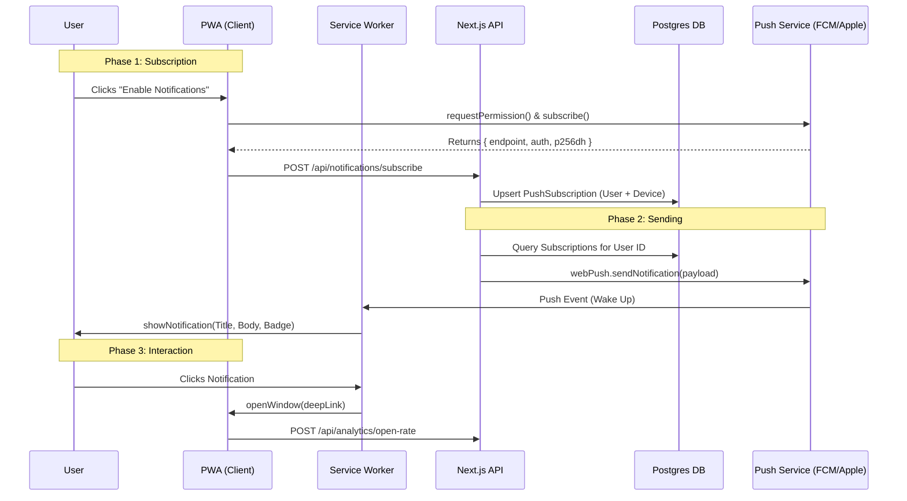

# Push Notification Architecture Design

> **Document Status**: Draft v2
> **Target Audience**: Senior Engineering & Product Team
> **Goal**: Define a scalable, high-engagement Notification System for WatashiWa (Next.js PWA).

## 1. Executive Summary

We will implement a **Service-Worker-First** notification system using the **Web Push API** and **VAPID** authentication. This allows us to re-engage users even when the browser is closed, bridging the gap between Web and Native.

**Key Technical Decisions:**

- **Protocol**: Web Push Protocol (Standard) via VAPID keys.
- **Backend**: Node.js `web-push` library managed by a dedicated `NotificationService`.
- **Database**: 1-to-Many relationship (User has many Devices).
- **Engagement Strategy**: "Smart & Silent" (Data-driven, not spammy).

---

## 2. Architecture Decision: Custom VAPID vs. Firebase (FCM)

The user asked: _"Does Firebase Notifications support our features?"_
**Answer: Yes, but with trade-offs.**

We have chosen **Native Web Push (Custom)** for WatashiWa. Here is the engineering logic (Trade-off Matrix) for this decision:

| Feature            | **Option A: Native Web Push (Chosen)**                    | Option B: Firebase (FCM)                                                             |
| :----------------- | :-------------------------------------------------------- | :----------------------------------------------------------------------------------- |
| **Dependency**     | **Zero** additional client SDKs. Uses browser native API. | Requires `firebase-js-sdk` (~20-50KB gzipped).                                       |
| **Service Worker** | **Full Control**. We manually write `sw.js` logic.        | **Black Box**. Relies on `firebase-messaging-sw.js` which can conflict with Workbox. |
| **Privacy**        | **High**. Tokens stay in our DB. No Google tracking.      | **Medium**. Metadata passes through Google servers.                                  |
| **Complexity**     | **Medium**. We manage VAPID keys & DB tokens.             | **Low**. Google manages keys & dashboard.                                            |
| **Performance**    | **Instant**. Direct browser API connection.               | **Slight Delay**. Init time for Firebase SDK.                                        |
| **Philosophy**     | "Zen" / Minimalist.                                       | "batteries-included".                                                                |

**Verdict**: As we are building a high-performance **PWA** with a custom "Offline First" Service Worker (Workbox), mixing in the heavy Firebase SDK often leads to initialization conflicts and "bloat". The Native VAPID approach is "cleaner" for Next.js.

---

## 3. High-Level Architecture



---

## 3. Core Use Cases & Scenarios

As a learning platform, our notifications must be timely and valuable, not annoying.

### Scenario A: The "Brain Leak" Prevention (Review Reminder)

- **Trigger**: A cron job runs every hour checking users who have > 20 reviews due and haven't studied in 24h.
- **Payload**:

  ```json
  {
  	"title": "🧠 24 words are slipping away...",
  	"body": "Quick 5-minute review to save them?",
  	"icon": "/assets/emojis/brain-leak.png",
  	"data": { "url": "/study?mode=review" },
  	"tag": "review-reminder" // Replaces previous review reminders
  }
  ```

- **Why**: High value. Users fear forgetting.

### Scenario B: The "Streak Rescue" (Urgent)

- **Trigger**: User has not studied by 9:00 PM local time. Streak is at risk.
- **Payload**:

  ```json
  {
  	"title": "🔥 Streak Danger: 12 Days!",
  	"body": "Don't break the chain. Do 1 card to keep it alive.",
  	"icon": "/assets/emojis/fire.png",
  	"actions": [
  		{ "action": "quick", "title": "Do 1 Card" },
  		{ "action": "snooze", "title": "Remind in 1h" }
  	]
  }
  ```

- **Native Feature**: Uses `actions` buttons to let users engage directly from the notification tray (Android only).

### Scenario C: "Community Wisdom" (Engagement)

- **Trigger**: Someone replies to your mnemonic or tip.
- **Payload**:

  ```json
  {
  	"title": "New reply from Aki",
  	"body": "That mnemonic is hilarious! I used it and...",
  	"icon": "/assets/avatars/aki.png",
  	"data": { "url": "/deck/123/card/456#comments" }
  }
  ```

### Scenario D: System Updates (Silent Push)

- **Trigger**: New content/deck deployed.
- **Behavior**:
  - **Silent Push**: The service worker wakes up, fetches the new cache in the background, but **DOES NOT** show a visible notification.
  - **Result**: When the user opens the app next time, it loads instantly with fresh data.

---

## 4. Detailed Data Model

To support multi-device syncing (e.g., clearing a notification on Desktop if read on Mobile), we store robust metadata.

```prisma
// Using PostgreSQL via Prisma
model PushSubscription {
  id        String   @id @default(uuid())

  // The User who owns this device
  userId    String   @map("user_id")
  user      User     @relation(fields: [userId], references: [id], onDelete: Cascade)

  // Keys required by Web Push Protocol
  endpoint  String   @unique // The "ID" of the device
  p256dh    String   // Public Encryption Key
  auth      String   // Auth Secret

  // Metadata for Smart Delivery
  userAgent String?  @map("user_agent") // "Chrome on Android" - helps debugging
  platform  String?  // "mobile" | "desktop"

  // Health Check
  failedCount Int      @default(0) @map("failed_count") // Circuit breaker
  lastActive  DateTime @default(now()) @map("last_active")

  createdAt DateTime @default(now()) @map("created_at")

  @@index([userId])
}
```

---

## 5. "Senior Engineer" Considerations

### A. VAPID & Security

- We use **VAPID (Voluntary Application Server Identification)**.
- **Why?**: It tells the Push Service (Google/Apple) that _we_ are the sender. No API keys stored in the app.
- **Key Rotation**: Critical. If we leak the private key, spammers can push to our users.

### B. The "410 Gone" Problem (Cleanup)

- **Problem**: Users clear browser data or uninstall the PWA. The subscription endpoint becomes invalid.
- **Solution**:
  - When `webPush.sendNotification()` returns `410 Gone` or `404 Not Found`.
  - **IMMEDIATELY** delete that record from `PushSubscription` DB.
  - _Do not skip this_, or we will be rate-limited by Google/Apple.

### C. Rate Limiting & User Fatigue

- **Policy**: No more than 1 notification per day unless "Urgent" (Streak Rescue).
- **Grouping**: Use the `tag` property. If we send 3 "New Comment" notifications, the phone should collapse them into one "3 New Comments" group, not fill the notification center.

### D. iOS quirks

- **Requirement**: User **MUST** add to Home Screen for Web Push to work on iOS (before iOS 17).
- **Strategy**: Our `PWAInstallPrompt` component is critical here. We must guide them to install before asking for notification permission.

---

## 6. Implementation Checklist

### Phase 1: Foundation

- [ ] Run `npx web-push generate-vapid-keys`.

- [ ] Add `NEXT_PUBLIC_VAPID_PUBLIC_KEY` and `VAPID_PRIVATE_KEY` to `.env`.
- [ ] Create `PushSubscription` table in Prisma.

### Phase 2: Service Layer

- [ ] Implement `NotificationService.send(userId, payload)`.

- [ ] Handle `410` errors and auto-delete subs.

### Phase 3: Client

- [ ] Update `sw.js` to handle `push` and `notificationclick` events.

- [ ] Create `usePushNotifications` hook with "Subscribe" UI.

### Phase 4: Scenarios

- [ ] Create cron job for **Scenario A (Review)**.

- [ ] Add trigger for **Scenario B (Comment Reply)**.

---

## 7. Extensibility & Future Scaling

As we grow from 10 to 100,000 users, the system is designed to evolve:

### A. Template System (Content Management)

Currently, messages are hardcoded or in `messages/*.json`.
**Future**: Move to a `NotificationTemplate` model in DB.

- Allows marketing team to edit copy without code deploys.
- Supports A/B testing of notification titles.

### B. Queue System (High Volume)

Currently, `NotificationService.sendToUser` sends immediately.
**Future**: If we send 1M notifications at 8 PM, we will need a Queue (e.g., BullMQ + Redis).

- **Producer**: Cron job pushes 1M Job IDs to Redis.
- **Consumer**: 50 Worker processes pull jobs and send via `web-push`.
- **Benefit**: Prevents server crash spikes; handles retries gracefully.

### C. Event Bus (Decoupling)

Currently, we call `NotificationService` directly in API routes.
**Future**: Use an Event Emitter pattern.

- `UserEvents.emit('friend_request', { ... })`
- `NotificationListener` listens and decides _if_ and _how_ to notify (Push vs Email vs In-App).

---

## 8. Multi-Channel Strategy (Email & SMS)

To avoid "Notification Fatigue," we apply a strict channel hierarchy. We do not spam users on all channels at once.

| Channel                  | Cost           | Use Case                                                                   | Frequency    | Provider Recommendation          |
| :----------------------- | :------------- | :------------------------------------------------------------------------- | :----------- | :------------------------------- |
| **A. Push Notification** | **Free**       | Real-time reminders, Streak alerts, Social interactions.                   | High (Daily) | Self-Hosted (Web Push)           |
| **B. Email**             | Low            | Weekly Progress Reports, "We Miss You" (>7 days inactive), Password Reset. | Low (Weekly) | **Resend** (Best DX for Next.js) |
| **C. SMS**               | **High** ($$$) | 2FA (Security), Critical Payment Alerts. **Never** for study reminders.    | Rare         | Twilio                           |

### Proposed Architecture for Multi-Channel

Abstract the sender behind a unified interface:

```typescript
// Future: src/services/UnifiedNotificationService.ts
async function notifyUser(userId: string, event: EventType) {
  const prefs = await getUserPreferences(userId);

  // 1. Try Push (Cheapest & Fastest)
  if (prefs.pushEnabled) {
    await PushService.send(userId, ...);
    return;
  }

  // 2. Fallback to Email (if urgent and push failed/disabled)
  if (event.isUrgent && prefs.emailEnabled) {
    await EmailService.send(userId, ...);
  }
}
```

In future, we will use this interface to send notifications to users.

Consider this: <https://www.inngest.com/docs>
