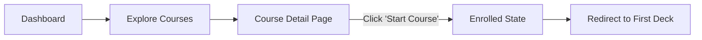

# Feature: Deck Grouping (Courses/Series)

## 1. Context & Problem

Currently, Decks are flat entities. Users want to organize them into larger progressions or collections, such as:

- **JLPT N5 Mastery** (Contains: Vocab N5, Kanji N5, Grammar N5...)
- **IELTS 5.0 Prep** (Contains: Unit 1, Unit 2, Unit 3...)
- **Genki I Textbook** (Contains: Chapter 1, Chapter 2...)

We need a higher-level entity to group and order these decks.

## 2. Terminology & Naming

**Decision**: We will use **Course** as the primary entity name.

- **Why?**: It implies structure, progress, and a "Curriculum" (e.g., "Mastery Course").
- **Alternative considered**: "Series" (good but implies sequential only), "Collection" (too loose).

## 3. User Scenarios

### A. The "Path Finder" (New Student)

**Persona**: Kenji, a beginner who doesn't know where to start.

1. **Goal**: Wants a guided path to learn N5.
2. **Action**: Browses "Courses", sees "Complete N5 Mastery".
3. **Result**: Enrolls in one click. The system now guides him: "Start Deck 1: Hiragana". He doesn't need to search for 20 separate decks.

### B. The "Curator" (Teacher/Advanced User)

**Persona**: Sarah, a teacher making a class for her students.

1. **Goal**: Group her 15 weeks of vocab decks into a cohesive package.
2. **Action**: Creates a Course "Fall Semester 2024". Adds existing Decks. Reorders them by week.
3. **Result**: Shares one link with her students.

### C. The "Textbook Owner"

**Persona**: A user following "Minna no Nihongo".

1. **Goal**: Study in exact chapter order.
2. **Action**: Finds the "Minna no Nihongo Book 1" Course.
3. **Result**: Sees decks "Lesson 1", "Lesson 2"... locked or ordered sequentially.

### D. The "Restarter" (Returning User)

**Persona**: Michael, who studied N5 months ago and is coming back.

1. **Goal**: Check what he remembers before moving to N4.
2. **Action**: Returns to "N5 Mastery" Course.
3. **View**: Sees the "Timeline" with some Green Checks (Mastered) and some Yellow (Due for review).
4. **Result**: Immediately knows to click "Continue" on the first Yellow deck to refresh memory, rather than starting from zero.

### E. The "Empty State" Observer

**Persona**: A new admin testing the system.

1. **Goal**: Verify course creation.
2. **Action**: Creates "New Course" but forgets to add decks.
3. **View**: Sees the "Course Detail" page.
4. **Result**: Instead of a broken page, sees a "No Decks Yet" placeholder with a "+" button, prompting immediate action.

## 4. User Flows

### Flow 1: Discovery & Enrollment

### Flow 2: Studying a Course

1. **Entry**: User clicks "N5 Mastery" on Dashboard.
2. **View**: Sees list of Decks.
   - Deck 1: [DONE] (Green Check)
   - Deck 2: [IN PROGRESS] (Show "Study Now" button)
   - Deck 3: [LOCKED/WAITING] (Optional lock, or just visual gray match)
3. **Action**: Clicks "Study Now" on Deck 2.
4. **Study Session**: Completes session for Deck 2.
5. **Return**: Returned to Course Detail. Progress bar updates: "15% -> 18%".

## 5. UI/UX Design ("Zen Mastery" Style)

### A. The "Course Card" (Dashboard/List View)

_Visuals_:

- **Shape**: Tall card (Portrait) or Wide Banner (Landscape), distinct from smaller Deck cards.
- **Color**: Heavy use of **Indigo (#1E3A5F)** background for "Official/Featured" courses to signify weight/importance.
- **Content**:
  - **Top**: Hero Image/Icon (e.g., "N5" typography).
  - **Middle**: Title "JLPT N5 Mastery". Subtitle "25 Decks • 1200 Words".
  - **Bottom**: Progress Bar (Thin, Gold/Matcha color). "3/25 Decks Complete".

### B. Course Detail Page (`/courses/[id]`)

_Layout_:

- **Header (Hero)**:
  - Full width `Washi` (Paper) background.
  - Large Kanji Typography: e.g., "始" (Start) or "道" (Path).
  - Title: "Complete N5 Path".
  - Stats: "Students: 1,200" | "Avg Time: 3 Months".
  - **Primary Action**: Sticky CTA Button.
    - _Not Enrolled_: "Begin Journey" (Indigo, filled).
    - _Enrolled_: "Continue: [Next Deck Name]" (Green/Matcha).

- **The Path (Deck List)**:
  - A vertical "Timeline" or "Steps" visualization, not just a table.
  - **Connector Line**: A vertical line connecting the decks (like a subway map).
  - **Deck Nodes**:
    - **Completed**: Circle with Checkmark (Matcha Green).
    - **Current**: Large, glowing Pulse effect. Card is expanded showing "Due: 5 cards".
    - **Future**: Faded/Ghosted.
  - **Interaction**:
    - Limit detailed stats on this view to reduce noise. Just "Mastery %" per deck.

### C. Creation Interface (Admin/Teacher)

_Interaction_:

- **Two-Pane Layout**:
  - **Left**: Course Structure (The "Ladder").
  - **Right**: Deck Search/Library.
- **Action**: Drag and drop decks from Right to Left.
- **Feedback**: Satisfying "Snap" sound/animation when a deck is docked into the course.

## 6. Design Strategy: "Zen Mastery"

The "Course" feature embodies our core **Zen Mastery** philosophy by prioritizing focus and reducing decision fatigue.

1. **Invisible Structure**:
   - Users shouldn't feel the weight of "200 flashcards." They should see **"One Path."**
   - The "Timeline" visualization hides the complexity of future decks, showing only the immediate next steps clearly (Pulse effect on current deck).

2. **Cognitive Ease**:
   - We use a **Mobile-First** card design that presents critical information (Progress, Title, Status) in a glanceable format.
   - **Color Coding**: Statuses are instantly recognizable without reading text.
     - **Indigo (#1E3A5F)**: The Path/Current Focus.
     - **Matcha (#708238)**: Mastery/Success.
     - **Washi (#F9F7F2)**: The Canvas/Background.

3. **Positive Reinforcement**:
   - "Mastered" decks are celebrated with distinct visual markers (Green Check + Success Text).
   - Progress bars are ever-present but subtle, encouraging "filling the bar" rather than "doing work."

## 7. Edge Cases & Handling

### A. Data Integrity

- **Deleted Decks**: If a deck is deleted from the system but remains in a Course, the UI must handle the `null` reference gracefully (e.g., skip rendering or show "Archived Item").
- **Missing Author**: If a deck's author account is deleted, the UI defaults to "Unknown" rather than crashing (Implemented Defensive Coding).

### B. User Experience

- **Empty Course**: If a user creates a course but hasn't added decks, we show a friendly "Empty State" with a clear CTA to "Add your first deck".
- **No Access**: If a Course contains "Private" decks that the current user doesn't own, those decks appear as "Locked" or "Private" with a padlock icon.

### C. Internationalization (i18n)

- **Dynamic Content**: Course Titles and Descriptions are user-generated and may not match the UI language.
- **UI Strings**: All static labels ("Learning Path", "Start", "Mastered") must use `t()` keys to support seamless switching between English and Vietnamese.

## 8. Functional Requirements & Data Model

## 6. Functional Requirements & Data Model

**(Unchanged from previous V1, see Schema)**

- **Ordering**: Critical. `sortOrder` in `CourseDeck` table.
- **Completion Logic**: A Course is "Complete" when all contained Decks are "Mastered" (or user marked as done).

## 7. Future Polish (V2)

- **Certificates**: Generate a PDF/Image certificate upon Course completion.
- **Prerequisites**: Actual hard locking of future decks (optional setting).
- **Assessments**: Insert "Checkpoint" exams between decks that are NOT flashcards (e.g., simple multiple choice quiz) to unlock the next stage.
