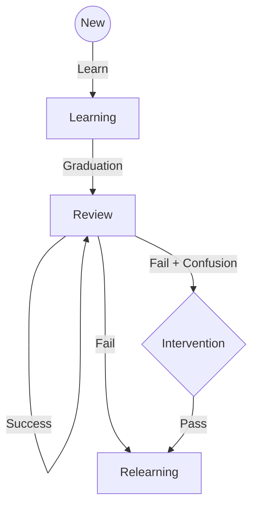

# SRS Architecture & Logic (V2)

## 1. Overview

WatashiWa V2 uses **FSRS v5** (Free Spaced Repetition Scheduler) as the core memory engine, wrapped by a **Smart Layer** that manages pacing and interventions.

## 2. Core FSRS Parameters

We track the standard FSRS tuple per card:

- `Difficulty (D)`: How hard is this card? (0-10)
- `Stability (S)`: How long until I forget? (Days)
- `Retrievability (R)`: Probability of recall today.

## 3. The "Smart Layer" Wrapper

The Smart Layer sits _above_ FSRS and modifies the queue.

### A. Pacing Control ("The Throttle")

**Problem:** FSRS efficiently schedules reviews, but doesn't care about user burnout.
**Logic:**

1. Check `DailyStudyStat.newCardsLearned`.
2. Check `RetentionRate` (Reviews marked 'Again' / Total Reviews).
3. **Rule:** If Retention < 85%, **BLOCK** new cards.
   - Message: "Retention dip detected. Focus on reviews today."

### B. Intervention Triggers ("The Shield")

**Problem:** FSRS handles "Leeches" (Chronically failed cards) by just suspending them.
**V2 Logic:**

1. Monitor `UserReview.lapses`.
2. If `lapses >= 3` OR `rating === 1` on a "Confusion Pair":
   - **Immediately** suspend normal SRS.
   - Trigger **Intervention Mode** (Split View Comparison).
   - Only resume SRS after successful intervention.

### C. Focus Metrics

**Data point:** `ReviewLog.duration` (ms).
**Insight:**

- Fast (< 2s) + Correct = High Recall (Increase Stability bonus).
- Slow (> 5s) + Correct = Hesitant (Reduce Stability bonus).

## 4. State Machine

